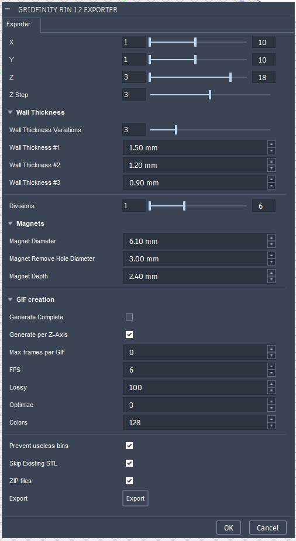
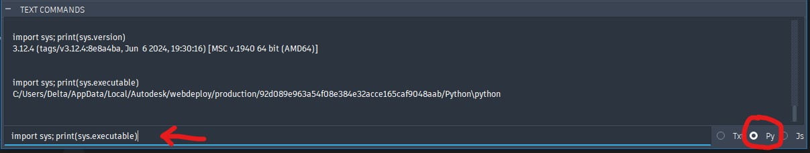
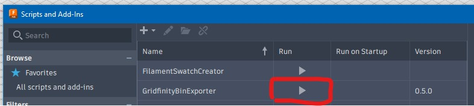
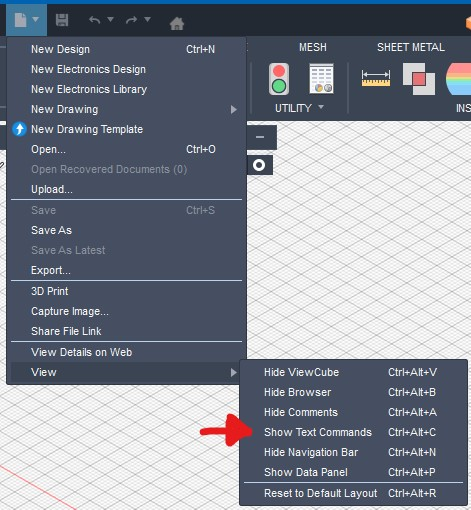

# Gridfinity Bin 1.2 Exporter

This F360 python script is for https://www.printables.com/model/1305693-2025-gridfinity-bin-12-latest-fix-with-more-sizes 

There you get ready to use mesh files and the Fusion 360 file.

This export script allows you to generate and export ready to use mesh files for 3d printing.

It offers also image / gif creation but thats mainly useful for setting up a new model on printables.



## Installation

_(NOTE: these are windows instructions, feel free to let me know how and if this works on other OS)_
Requirements: Fusion 360 and Python 3

> This script requires some additional Python modules and it's not as straightforward as you think :(

- You need to install this Addin-In: https://apps.autodesk.com/FUSION/en/Detail/Index?id=2114937992453312456
- Clone (or download zip and extract) into `C:\Users\%username%\AppData\Roaming\Autodesk\Autodesk Fusion 360\API\Scripts\GridfinityBinExporter`
- If you want to use the GIF creation, download and extract `https://eternallybored.org/misc/gifsicle/` into ./bin (Only Windows Supported atm, feel freel to submit a request or PR if you need this on linux / mac)

### Install dependencies

Fusion360 uses it's own Python env and therefore we need to install the correct versions to make it work.

#### Python3 on machine
You can either install **the same Python version** on your machine and then simply install the dependencies within the just cloned project (`C:\Users\%username%\AppData\Roaming\Autodesk\Autodesk Fusion 360\API\Scripts\GridfinityBinExporter`):

`pip install -r requirements.txt -t ./__pypackages__ --upgrade -I --no-cache-dir`

---

To get the Python version of Fusion 360, open the Text Commands in Fusion 360 (see [Troubleshooting](#Troubleshooting)) and execute: 

```py
import sys; print(sys.version) 
```

#### Python of Fusion 360

Or you need to do get the Python path. To do this, you need to open the Text Commands (see [Troubleshooting](#Troubleshooting))


Ensure the "py" mode is selected (bottom right) and execute the following Python code:

```py
import sys; print(sys.executable)
```

This will output the path to F360 Python. Copy this path and use it for the command below inside of the cloned directory (`C:\Users\%username%\AppData\Roaming\Autodesk\Autodesk Fusion 360\API\Scripts\GridfinityBinExporter`):

```bat
"C:/Users/%username%/AppData/Local/Autodesk/webdeploy/production/%hash%/Python\python" -m pip install -r requirements.txt -t ./__pypackages__ --upgrade -I --no-cache-dir
```



## Usage / Configuration

Once installed, run it by clicking on run: `Utilities -> Add-Ins -> Run (icon)`


The exporter tool should popup (if not see [Troubleshooting](#Troubleshooting)).

The options should be self explanatory, once configured click on the `Export` button at the bottom.

> Ok (no functionality yet!) & Cancel will simply close the exporter, you must use the `Add-Ins -> Run` to open the exporter again

Once clicked on Export, a new Modal should popup and ask for the path where the mesh files (and optional gif/zip) will be generated.

Then simply wait and let the exporter do it's thing ✨.

## Troubleshooting

### Text Commands / Debugging in F360

Open the Text Commands (`Ctrl + Alt + A`) to see whats happening:



### When I run the script, nothing happens

Most likely the installation of the Python modules failed or it the wrong Python version.

It could be of course another Python startup error but most likely this.

### The script is not working anymore

- Either a new update added a new Python version (then reinstall the dependencies) or the update broke the functionallity (please report)
- Or I made a mistake (please report :D)

## Notes

- ⚠️ I released this version as is, I want to refine and improve it and make it a bit more solid.
- Python isn't my main language 🙃
- Generation might take some time, not sure if this can be optimized
- No idea how resource hungry this is

## Development

To setup the tooling, simply right click in the "Scripts and Add-Ins" window on the script and "Edit in code editor",
this will write some settings for vscode (.vscode/settings.json) and Python should be setup and ready to go and you can debug, etc.

See also the [Resources](#Resources) for more information / documentation.

## Roadmap

- Improve code and make it more robust and generic
  - get rid of some duplicates and clearer logic
- Switch from Add-In to native Fusion360 Parametric Text (yes this is a thing finally since September! ♥️)
- In the future the script will autorun and introduce an UI button which can be clicked to open the Exporter, no manual "Run" is needed anymore
- Remember last settings + reset
- Add scoop curve to filename / template (like `TPL_VARIANT_FOLDER`)

## Resources

- https://gridfinity.xyz/specification/
- https://help.autodesk.com/view/fusion360/ENU/?guid=GUID-743C88FB-CA3F-44B0-B0B9-FCC378D0D782